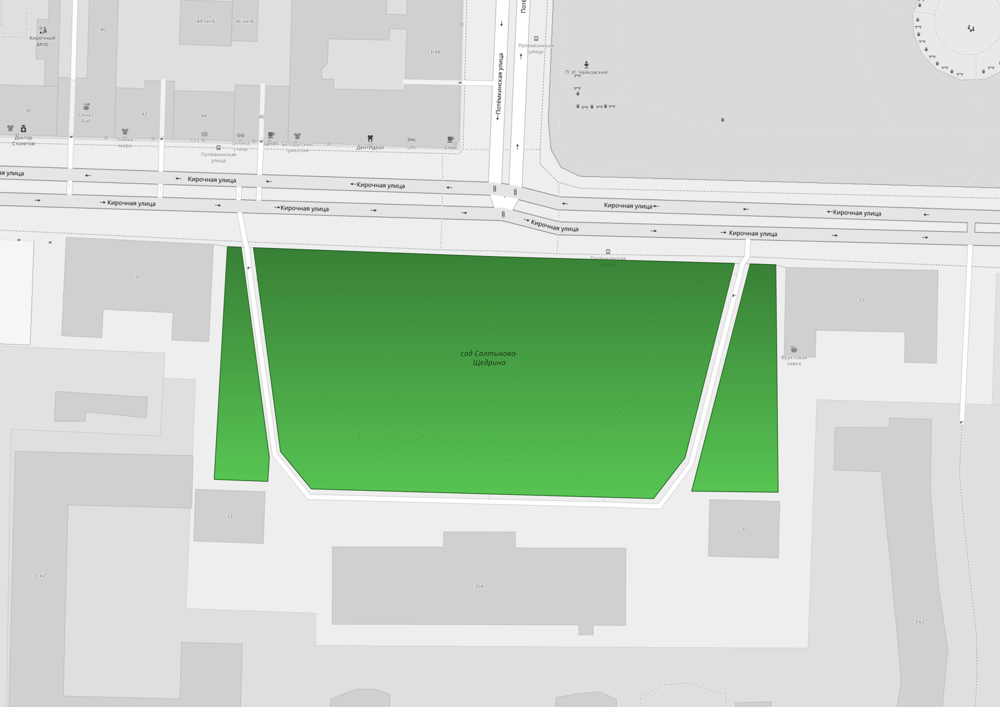
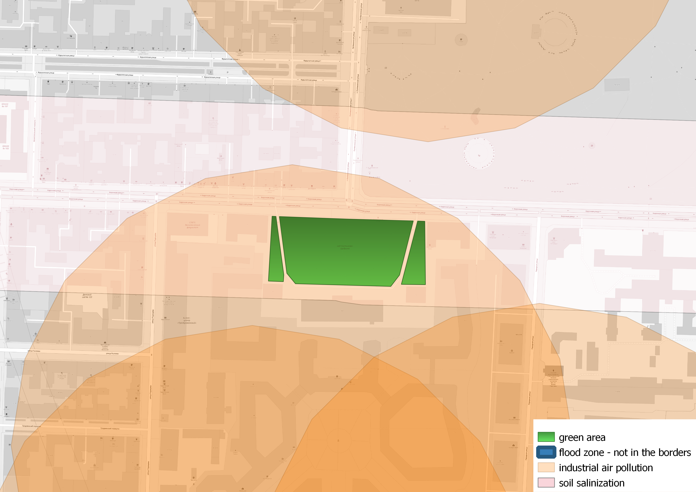
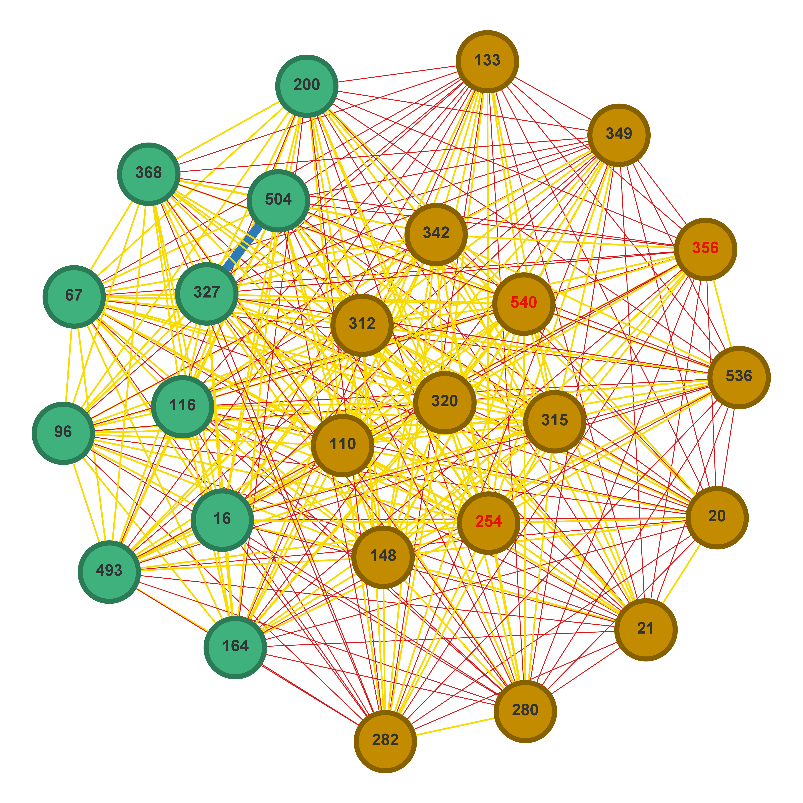

# Landscaping project

|           |                                                                                                                                                   |
|----------:|:-------------------------------------------------------------------------------------------------------------------------------------------------:|
| License   |                                                                                    |
| Languages |   |

Repository of science research at ITMO University #622263 "Planning city greenery species composition with using network modeling methods".

## Porject structure

- [**backend**](backend/README.md) - backend service, which provides the access to database plants data (including insertion and updating)
    and keeps database schema syncronized.
- [**frontend**](frontend/README.md) - frontend written on Flutter, which can be compiled to web-interface used with Nginx.
- [**photos**](photos/README.md) - plants photos hosting Docker service and photos preparation/insertion scripts.
- [**method**](method/README.md) - derevo module containing plants compositions generation and graph algorithms.

## Description

In this project we propose the plants composition algorithm which can generate new sets of recommended plant
    species for green areas or update sets for existing ones. This algorithm accounts for a number of external
    and internal natural and anthropogenic factors, for example, light conditions, interspecies compatability
    or soil salinization. Algorithm's pipeline consists of two main steps: spatial analysis block where suitable
    species are selected, and ecological network analysis block where community partition method is used
    on species interaction graph to generate several compositions of plants.

We also provide methods of knowledge database creation and spatial environmental data collection.

The deployed demo frontend instance can be found at https://derevo.idu.actcognitive.org with REST
    API at [/api](https://derevo.idu.actcognitive.org/api/docs) postfix.

## General scheme of work

## Example

Scripts for step 0 are in the "database" folder, steps 1-8 can be done with `update_current_composition`,
    `get_recommended_composition` or `get_composition_unknown` functions from [get_composition module](method/get_composition.py).

0. Create knowledge database

1. Generate compatability graph based on knowledge database

    

2. Select an area for composition generation

    

3. Download light conditions

4. Download external limitation factor

    

5. Select a list of species which have suitable light conditions in this area and resistant for limitation factors

6. Generate a subgraph of compatability graph with selected species as nodes
    

7. Use community partition method to create compositions

    - Variant 1:

    

    - Variant 2:

    
