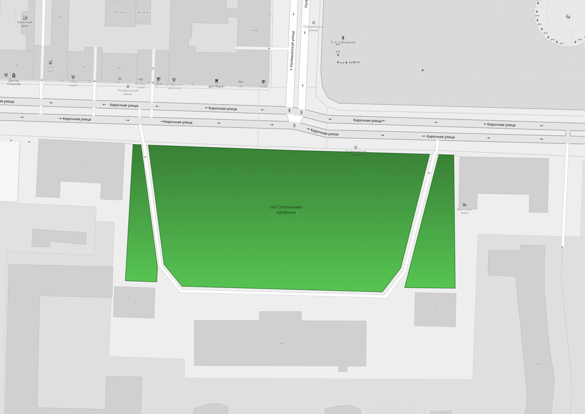
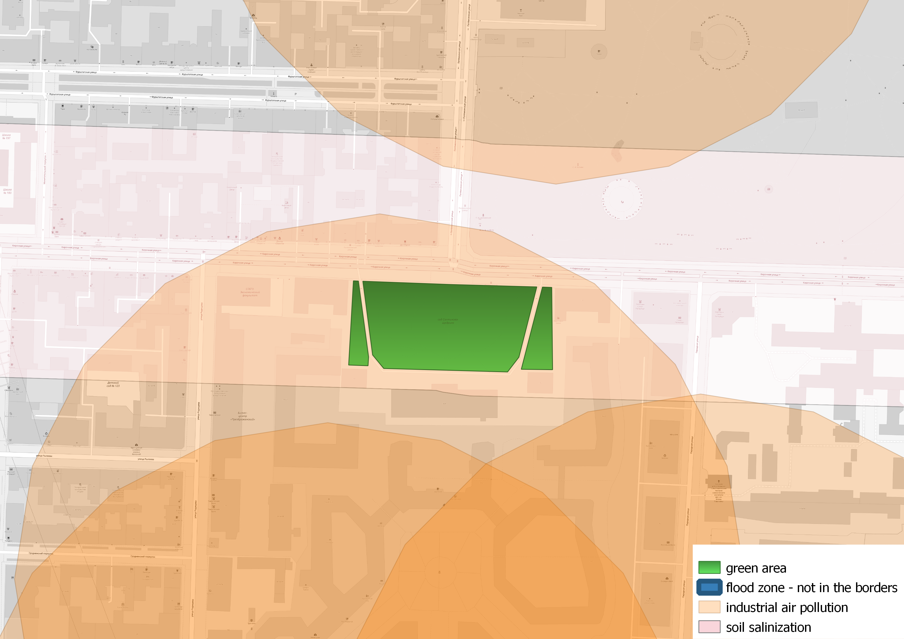
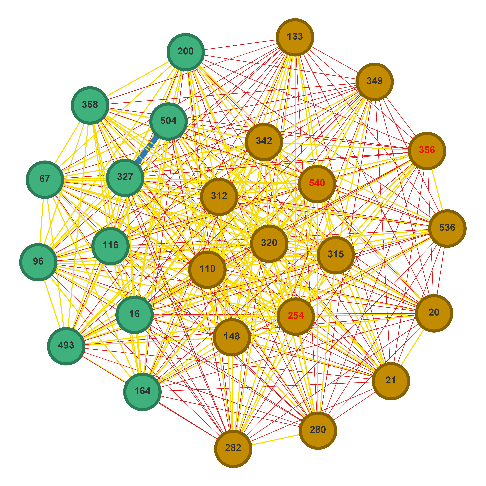

# Проект планирования видового состава

|           |                                                                                                                                                   |
|----------:|:-------------------------------------------------------------------------------------------------------------------------------------------------:|
| Лицензия  |                                                                                    |
| Переводы  |   |

Репозиторий проекта НИР: № 622263 «Планирование видового состава городских зеленых насаждений при помощи сетевого моделирования».

## Структура проекта

- [**backend**](backend/README.md) - бэкенд-сервис, позволяющий получать доступ к данных о растениях (включая загрузку и обновление),
    а также поддерживающий схему базы данных в актуальном состоянии.
- [**frontend**](frontend/README.md) - фронтенд на Flutter, собираемый в веб-интерфейс, позже выдающийся статикой через Nginx
- [**photos**](photos/README.md) - Docker-сервис выдачи фотографий растений и скрипты подготовки и вставки имеющихся изображений.
- [**method**](method/README.md) - модуль основного метода создания композиций видового состава и работы с графами.

## Описание

В данном проекте мы представляем алгоритм создания видового состава, способный генерировать новые наборы
    растений, рекоммендованных к высадке на заданных зеленых зонах с учетом возможного имеющегося состава.
    Алгоритм учитывает внешние, внутренние и антропогенные факторы, такие как освещенность, сочетаемость растений
    или засоленность почвы. Работа алгоритма состоит из двух основных этапов: пространственный анализ территории,
    выбранной пользователем, чтобы выбрать список растений, которым подходят условия, и этап сетевого моделирования,
    где на граф сочетаемости применяется метод разделения групп для генерации нескольких вариантов видового состава.

Развернутый демо-фронтенд расположен по адресу https://derevo.idu.actcognitive.org, а REST API - на
    постфиксе [/api](https://derevo.idu.actcognitive.org/api/docs).

Бэкенд также интегрирован в Платформу Цифровой Урбанистики от Лаборатории Анализа Городских Данных университета ИТМО.
    Фронтенд располагается по адресу https://dc.idu.actcognitive.org/applied-services/greenery.

Страниац описания работы сервиса расположена по адресу https://news.egov.itmo.ru/map/dev/index.html.

Документация основного метода расположена на https://derevo.readthedocs.io/en/dev/.

## Общая схема работы

## Публикации

Главные результаты работы описаны в следующих публикациях:

1. Value-Oriented Management of City Development Programs Based on Data from Social Networks. Nizomutdinov, B.A., Uglova, A.B., Antonov, A.S. Lecture Notes in Computer Science (including subseries Lecture Notes in Artificial Intelligence and Lecture Notes in Bioinformatics) this link is disabled, 2023, 13957 LNCS, PP 369–382 (Scopus - опубликована)
2. Sergey Mityagin, Nikita Kopyt, Irina А. Shmeleva, Sofia Malysheva, Ekaterina Malysheva, Aleksandr Antonov, Aleksey Sokol, Nikita Zakharenko, Tatiana Churiakova, Semen A. Budennyy, Alexander V. Boukhanovsky. Green Spaces in Urban Environments: Network Planning of Plant Species Composition // Sustainability. 2023 (Scopus - принята в мае 2023)
3. Boris Nizomutdinov and Nikita Kopyt  Planning of the species composition of urban green spaces using network modeling and comments from users of social networks. Internet and Modern Society (IMS-2023) - (текст принят в апреле 2023, доклад в июне 2023), по итогам выходит сборник в Injoit - ВАК)
4. Boris Nizomutdinov, Nikita Kopyt Development of a network model for urban greening based on the characteristics of plant growth. Young DTGS – 2023 (РИНЦ)
5. Низомутдинов, Б. А. Планирование видового состава зеленых насаждений на основе текстовых комментариев горожан / Б. А. Низомутдинов, Н. М. Копыть // Управление информационными ресурсами: Материалы XIX Международной научно-практической конференции, Минск, 22 марта 2023 года. – Минск: Академия управления при Президенте Республики Беларусь, 2023. – С. 366-368. (РИНЦ)

## Пример работы

Для создания базы данных следует выполнить миграции Alembic в [модуле бэкенда](backend/README.md)
    и загрузки данных растений в сервис,
    а шаги 1-8 выполняются с помощью `update_current_composition`, `get_recommended_composition`
    и `get_composition_unknown` функций из [модуля get_composition](method/get_composition.py).

0. Подготовка базы данных и заполнение ее растениями и их свойствами.

1. Создание графа сочетаемости, основанном на информации о сочетаемости из базы данных.

    

2. Выбор области для генерации породного состава.

    

3. Подготовка слоя освещенности.

4. Подготовка слоя внешних лимитирующих факторов.

    

5. Выбор набора растений, которым подходит освещенноть, и которые способны выдерживать лимитирующие факторы для заданной обалсти.

6. Создание подграфа графа сочетаемости с отобранными ранее растениями.
    

7. Использование метода разделение групп для создания вариантов видового сотава.

    - Вариант 1:

    

    - Вариант 2:

    
