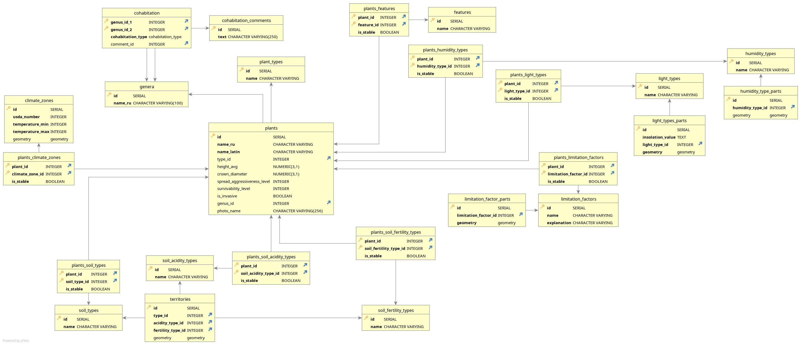

# plant_db database creation

These scripts prepare and fill the database with plants data.

To get it working you will need a document of plants in a specific format.

## usage

1. Install PostgreSQL DBMS server and PostGIS plugin, prepare an empty database  
2. Run `1_create_schema.sql` and `2_insert_data.sql` at the created database
3. Obtain latest version of `База данных породного состава.xlsx`, set database credentials
  in environment variables and run `python 3_parse_xlsx_to_db.py filename.xlsx` to parse data
  and load it to the database
4. To load photos go to [photos part](../photos/README.md)

## database schema

